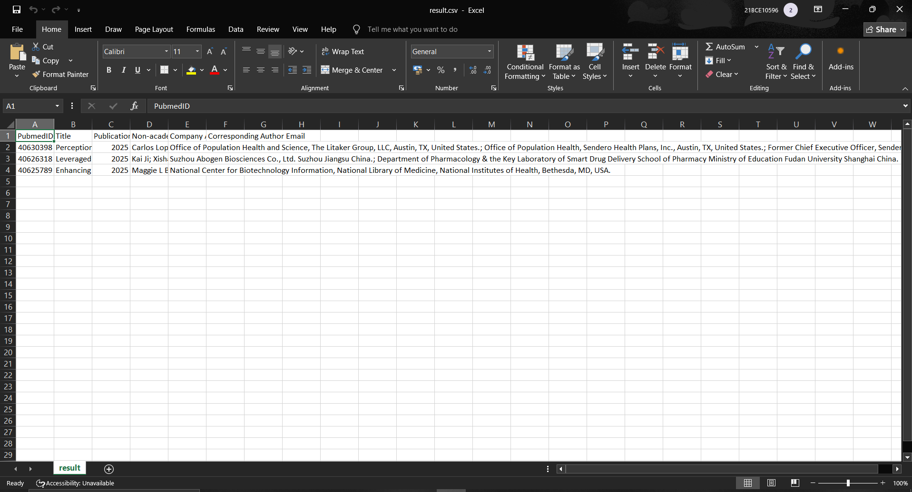

# PubMed Paper Fetcher

## Description
This command-line tool fetches research papers from PubMed based on a user-provided query and filters out papers with at least one non-academic author affiliated with a pharmaceutical or biotech company.

## Features
- Query PubMed using custom search strings
- Filter authors with non-academic affiliations (pharma/biotech focus)
- Output results as a CSV file or print to console
- Modular, typed Python code with Poetry dependency management

## Installation

```bash
git clone https://github.com/muskan-230703/pubmed-paper-fetcher
cd pubmed-paper-fetcher
poetry install
```

## Usage

```bash
# Print papers to console
poetry run get-papers-list "covid vaccine"

# Save results to CSV with debug info
poetry run get-papers-list "cancer treatment" -d --file result.csv
```

## 📸 Sample Output



## License

This project is licensed under the MIT License.  
© 2025 Muskan Yadav
